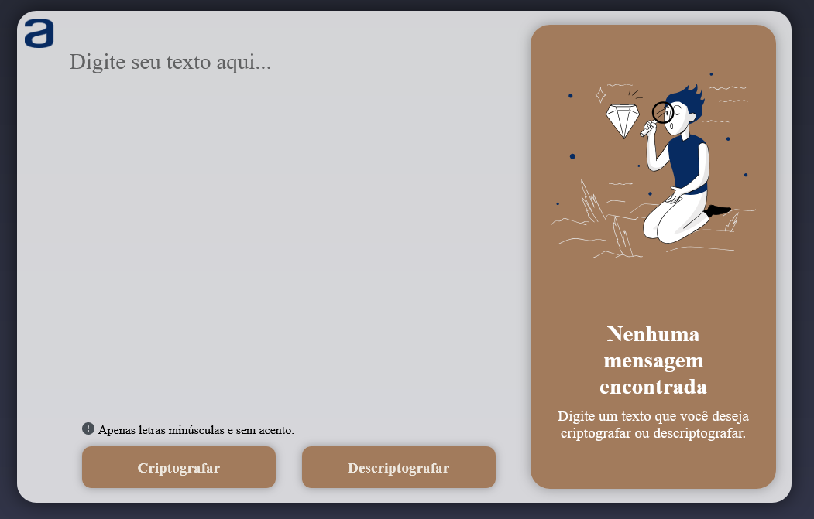

# Decodificador de Texto 💎

Olá, este é um challenge do curso Oracle ONE. O projeto consiste em um decodificador de texto, construído utilizando HTML, CSS e JavaScript.

## Funcionalidades ✔️

- Codificar uma mensagem de texto
- Decodificar uma mensagem de texto previamente codificada
- Mensagens devem conter apenas letras minúsculas e sem acento
- Botão de copiar texto codificado

## Tecnologias Utilizadas ✔️

- HTML
- CSS
- JavaScript

## Como Utilizar 🚀

- Visite este site:
   https://decodificador-leandro.vercel.app

## Screenshots 💎

